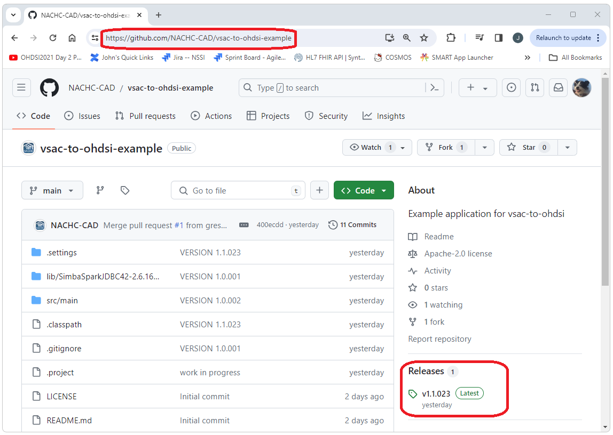
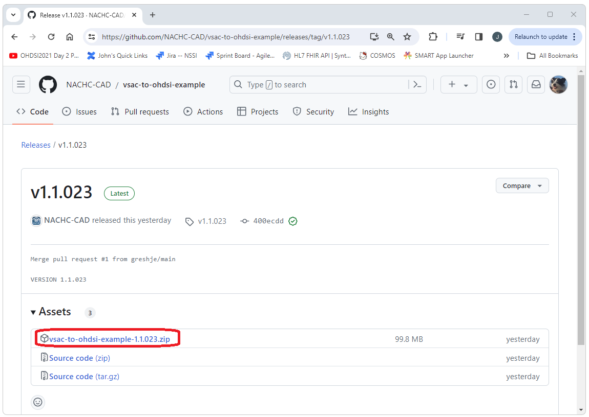
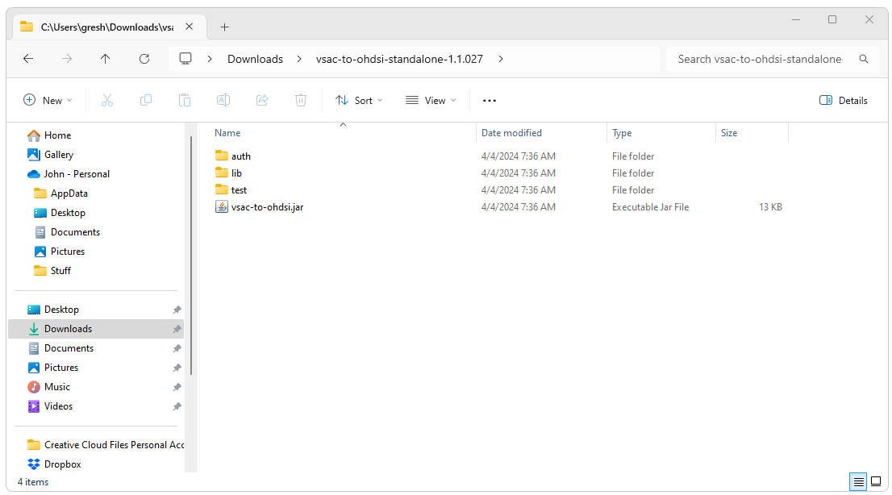

<!--
*
* javascript
*
* -->

<script>
  function openFullSizeImage(imageSrc) {
    // Open a new window with the full-size image
    window.open(imageSrc, '_blank', 'width=auto,height=auto');
  }
</script>

## Introduction

<div style="text-align: justify;">
  <p>
    This document describes how to generate a list of OHDSI concept_id values 
    from a VSAC value set exported from VSAC. 
    <ul>
      <li>
        <b>VSAC</b><br/>
        For more information on getting started with VSAC 
        (e.g. creating an account and generating user credentials) refer to: <br/> 
        <a href="./getting-started-vsac.html" />Getting Started with VSAC</a> 
      </li>
      <li>
        <b>VSAC Value Sets</b><br/>
        For more information on selecting, using, and exporting VSAC value sets refer to: <br/>
        <a href="./getting-started-vsac-value-sets.html">Getting Started with VSAC Value Sets</a> 
      </li>
    </ul>
    The output of a download of a value set from VSAC is a single zip file 
    that contains text files including the files that describe the value set composition. 
    This zip file is what will be used to generate the OHDSI concept_id values. 
  </p>
  <p>
    The following steps to import a VSAC value set into OHDSI are detailed here
    <ul>
      <li>
        Download and install the vsac-to-ohdsi standalone application
      </li>
      <li>
        Configure the connection to your instance of the CDM and other properties
      </li>
      <li>
        Run the vsac-to-ohdsi standalone application 
        to generate OHDSI concept_id values for the concepts in the VSAC value set
      </li>
      <li>
        Create an OHDSI concept set for your VSAC concepts using Atlas
      </li>
      <li>
        Accessing the vsac-to-ohdsi API programmatically using Java
      </li>
    </ul>
  </p>
</div>

<!---
*
* Install vsac-to-ohdsi Standalone
*
* -->

## Install VSAC-TO-OHDSI

<div style="text-align: justify;">
  The vsac-to-ohdsi standalone application can be downloaded from the Github page at 
  <a href="https://github.com/NACHC-CAD/vsac-to-ohdsi-example">https://github.com/NACHC-CAD/vsac-to-ohdsi-example</a>. 
  A fully build and ready to run version can be downloaded by selecting the link for the latest release 
  and then downloading the zip file for that version. 
  <br/><br/>
  Navigate the the Github repository and select the latest release.
  <br/>
  
  <br/>
  <br/>
  Download the zip file. 
  <br/>
  
  <br/>
  <br/>
  After extracting the zip file you should see a folder that contains the vsac-to-ohdsi.jar file, 
  a test folder, a lib folder, and an auth folder. 
  The vsac-to-ohdsi.jar file is the executable for the standalone application. 
  The test folder contains some files from VSAC that can be used for testing. 
  The lib folder contains the jar files for the dependencies of the standalone application. 
  The auth folder contains the configuration files that will be use to configure this application for your specific implementation 
  (e.g. database type, schema name, database connectivity, etc.). 
  <br/>
  
  
  
  
  
</div>


<!---
*
* Configure 
*
* -->

## Configure

<div style="text-align: justify;">
  There are only a few parameters that need to be configured to run vsac-to-ohdsi. 
  To update the configuration with your parameters:
  <ul>
    <li>Open the ./auth folder</li>
    <li>Open the auth.properties file</li>
    <li>Update this file with your configuration</li>
  </ul>
  The auth.properties provided by default includes the following. 
  If you are using Databricks you will only need to change the url and the token values. 
```
JdbcUrl=jdbc:spark://nachc-databricks.cloud.databricks.com:443/vsac_to_omop;transportMode=http;ssl=1;httpPath=sql/protocolv1/o/3956472157536757/0123-223459-leafy532;AuthMech=3;UID=token;PWD=
Token=MY_SECRET_TOKEN_GOES_HERE
SchemaName=vsac_to_omop
DatabaseType=spark
```
  The only required parameters are:
  <ul>
    <li>
      <b>JdbcUrl</b><br/>
      The url that points the the CDM schema that contains the vocabulary tables you are using
    </li>
    <li>
      <b>Token</b><br/>
      The token/password that will be used to connect to the database
    </li>
    <li>
      <b>SchemaName</b><br/>
      The name of the database that contains the vocabulary tables you are using
    </li>
    <li>
      <b>DatabaseType</b><br/>
        The RDMS that will be used (e.g. Spark (Databricks), PostgreSql, MS SqlServer, etc.)
    </li>
  </ul>
  
</div>

<!---
*
* Run VSAC-TO-OHDSI Standalone
*
* -->

## Run VSAC-TO-OHDSI

<div style="text-align: justify;">
</div>

<!---
*
* Create OHDSI Concept Set
*
* -->

## Create OHDSI Concept Set

<div style="text-align: justify;">
</div>

<!---
*
* The VSAC-TO-OHDSI API
*
* -->

## The VSAC-TO-OHDSI API

<div style="text-align: justify;">
</div>

