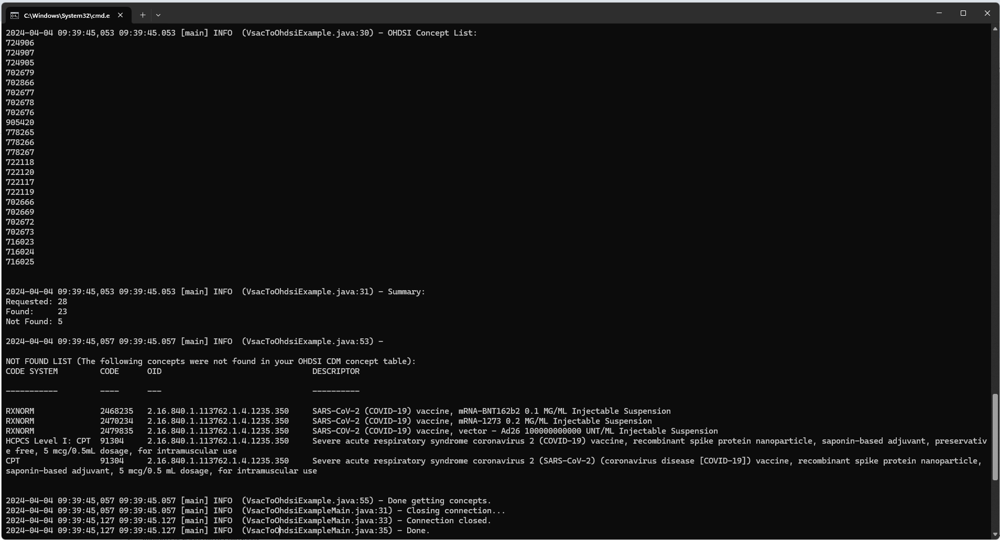

<!--
*
* javascript
*
* -->

## Introduction

  

    This document describes how to generate a list of OHDSI concept_id values 
    from a VSAC value set exported from VSAC. 
    <ul>
      <li>
        <b>VSAC</b> 
        For more information on getting started with VSAC 
        (e.g. creating an account and generating user credentials) refer to:   
        <a href="./getting-started-vsac.html" />Getting Started with VSAC</a> 
      </li>
      <li>
        <b>VSAC Value Sets</b> 
        For more information on selecting, using, and exporting VSAC value sets refer to:  
        <a href="./getting-started-vsac-value-sets.html">Getting Started with VSAC Value Sets</a> 
      </li>
    </ul>
    The output of a download of a value set from VSAC is a single zip file 
    that contains text files including the files that describe the value set composition. 
    This zip file is what will be used to generate the OHDSI concept_id values. 
  

  

    The following steps to import a VSAC value set into OHDSI are detailed here
    <ul>
      <li>
        Download and install the vsac-to-ohdsi standalone application
      </li>
      <li>
        Configure the connection to your instance of the CDM and other properties
      </li>
      <li>
        Run the vsac-to-ohdsi standalone application 
        to generate OHDSI concept_id values for the concepts in the VSAC value set
      </li>
      <li>
        Create an OHDSI concept set for your VSAC concepts using Atlas
      </li>
      <li>
        Accessing the vsac-to-ohdsi API programmatically using Java
      </li>
    </ul>
  

<!---
*
* Install vsac-to-ohdsi Standalone
*
* -->

## Install VSAC-TO-OHDSI

  The vsac-to-ohdsi standalone application can be downloaded from the Github page at 
  <a href="https://github.com/NACHC-CAD/vsac-to-ohdsi-example">https://github.com/NACHC-CAD/vsac-to-ohdsi-example</a>. 
  A fully build and ready to run version can be downloaded by selecting the link for the latest release 
  and then downloading the zip file for that version. 
    
  Navigate the the Github repository and select the latest release.
   
  
   
   
  Download the zip file. 
   
  
   
   
  After extracting the zip file you should see a folder that contains the vsac-to-ohdsi.jar file, 
  a test folder, a lib folder, and an auth folder. 
  The vsac-to-ohdsi.jar file is the executable for the standalone application. 
  The test folder contains some files from VSAC that can be used for testing. 
  The lib folder contains the jar files for the dependencies of the standalone application. 
  The auth folder contains the configuration files that will be use to configure this application for your specific implementation 
  (e.g. database type, schema name, database connectivity, etc.). 
   
  
  
  
  
  

<!---
*
* Configure 
*
* -->

## Configure

  There are only a few parameters that need to be configured to run vsac-to-ohdsi. 
  To update the configuration with your parameters:
  <ul>
    <li>Open the ./auth folder</li>
    <li>Open the auth.properties file</li>
    <li>Update this file with your configuration</li>
  </ul>
  The auth.properties provided by default includes the following. 
  If you are using Databricks you will only need to change the url and the token values. 
<pre class="pre-scrollable">
JdbcUrl=jdbc:spark://nachc-databricks.cloud.databricks.com:443/vsac_to_omop;transportMode=http;ssl=1;httpPath=sql/protocolv1/o/3956472157536757/0123-223459-leafy532;AuthMech=3;UID=token;PWD=
Token=MY_SECRET_TOKEN_GOES_HERE
SchemaName=vsac_to_omop
DatabaseType=spark
</pre>
  The only required parameters are:
  <ul>
    <li>
      <b>JdbcUrl</b> 
      The url that points the the CDM schema that contains the vocabulary tables you are using
    </li>
    <li>
      <b>Token</b> 
      The token/password that will be used to connect to the database
    </li>
    <li>
      <b>SchemaName</b> 
      The name of the database that contains the vocabulary tables you are using
    </li>
    <li>
      <b>DatabaseType</b> 
        The RDMS that will be used (e.g. Spark (Databricks), PostgreSql, MS SqlServer, etc.)
    </li>
  </ul>
  

<!---
*
* Run VSAC-TO-OHDSI Standalone
*
* -->

## Run VSAC-TO-OHDSI

  To run vsac-to-ohdsi open a cmd window and navigate to the directory where the files were unszipped. 
  Enter the command shown below using the path to the zip file downloaded from VSAC you would like to use. 
  In this example we are using a file that was downloaed from VSAC 
  that is provided in the test folder of the vsac-to-ohdsi download. 
<pre class="pre-scrollable">
java -jar vsac-to-ohdsi.jar "./test/zip/RetrieveMultipleValueSets_2.16.840.1.113762.1.4.1235.350.txt.zip"
</pre>
  After the code has completed you should see output similar to the following. 
   
  
   
   
  The important pieces of the output include the following.
   
  The list of OHDSI concept_id values

<pre class="pre-scrollable">
2024-04-04 09:39:45,053 09:39:45.053 [main] INFO  (VsacToOhdsiExample.java:30) - OHDSI Concept List:
724906
724907
724905
702679
702866
702677
702678
702676
905420
778265
778266
778267
722118
722120
722117
722119
702666
702669
702672
702673
716023
716024
716025

</pre>

   
  The number of codes in the VSAC value set (Requested), 
  the number of concepts that could be mapped to the OHDSI concept_id values in your CDM, 
  and the number of concepts that were not found.

<pre class="pre-scrollable">
2024-04-04 09:39:45,053 09:39:45.053 [main] INFO  (VsacToOhdsiExample.java:31) - Summary:
Requested: 28
Found:     23
Not Found: 5

</pre>
   
  A list of the VSAC concepts that were not found. 

<pre class="pre-scrollable">
2024-04-04 09:39:45,057 09:39:45.057 [main] INFO  (VsacToOhdsiExample.java:53) -

NOT FOUND LIST (The following concepts were not found in your OHDSI CDM concept table):
CODE SYSTEM         CODE      OID                                DESCRIPTOR
-----------         ----      ---                                ----------

RXNORM              2468235   2.16.840.1.113762.1.4.1235.350     SARS-CoV-2 (COVID-19) vaccine, mRNA-BNT162b2 0.1 MG/ML Injectable Suspension
RXNORM              2470234   2.16.840.1.113762.1.4.1235.350     SARS-CoV-2 (COVID-19) vaccine, mRNA-1273 0.2 MG/ML Injectable Suspension
RXNORM              2479835   2.16.840.1.113762.1.4.1235.350     SARS-COV-2 (COVID-19) vaccine, vector - Ad26 100000000000 UNT/ML Injectable Suspension
HCPCS Level I: CPT  91304     2.16.840.1.113762.1.4.1235.350     Severe acute respiratory syndrome coronavirus 2 (COVID-19) vaccine, recombinant spike protein nanoparticle, saponin-based adjuvant, preservative free, 5 mcg/0.5mL dosage, for intramuscular use
CPT                 91304     2.16.840.1.113762.1.4.1235.350     Severe acute respiratory syndrome coronavirus 2 (SARS-CoV-2) (coronavirus disease [COVID-19]) vaccine, recombinant spike protein nanoparticle, saponin-based adjuvant, 5 mcg/0.5 mL dosage, for intramuscular use

</pre>

<!---
*
* Create OHDSI Concept Set
*
* -->

## Create OHDSI Concept Set

  To import the VSAC concepts into OHDSI 
  open Atlas, navigate to Concept Sets, Create a New Concept Set, 
  select the Import tab, paste the list of OHDSI concept_id values into the Concept Identifiers tab, 
  and then select Add To Concept Set. 
   
  
   
   
  The imported concepts can now be viewed by selecting the Included Concepts tab. 
   
  
  
  

<!---
*
* The VSAC-TO-OHDSI API
*
* -->

## The VSAC-TO-OHDSI API

  The vsac-to-ohdsi API can be integrated into any Java project using Maven (MVN) 
  by adding something similar to the following to the projects pom.xml file. 
   
  <ul>
    <li>
      Refer to the Standalone/Example application for a complete pom.xml file: 
      <a href="https://github.com/NACHC-CAD/vsac-to-ohdsi-example">
        https://github.com/NACHC-CAD/vsac-to-ohdsi-example
      </a>
       
    </li>
    <li>
      Check the Maven Central repository
      for the latest versions: 
      <a href="https://central.sonatype.com/artifact/org.nachc.cad.tools/vsactoohdsi">
        https://central.sonatype.com/artifact/org.nachc.cad.tools/vsactoohdsi
      </a> 
    </li>
  </ul>
  
<pre class="pre-scrollable">
&lt;dependency&gt;
		&lt;groupId&gt;org.nachc.cad.tools&lt;/groupId&gt;
		&lt;artifactId&gt;vsactoohdsi&lt;/artifactId&gt;
		&lt;version&gt;1.1.025&lt;/version&gt;
&lt;/dependency&gt;
</pre>

