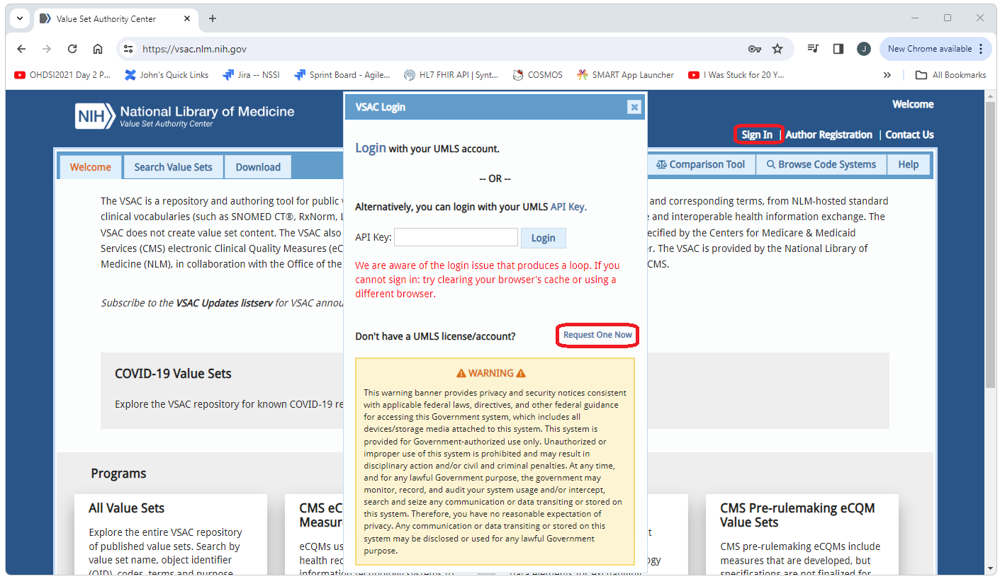
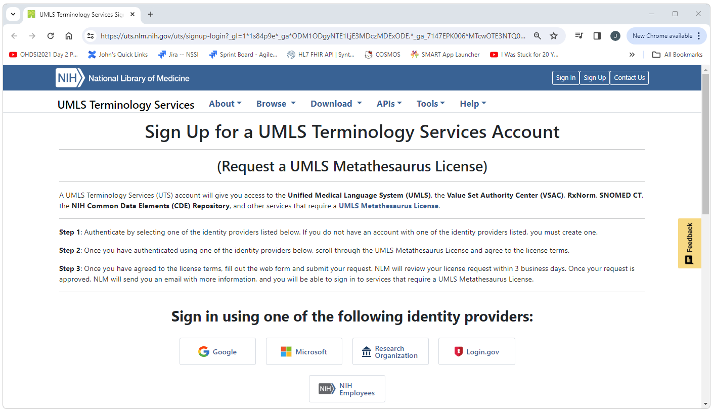
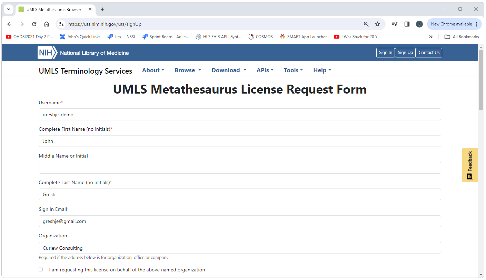
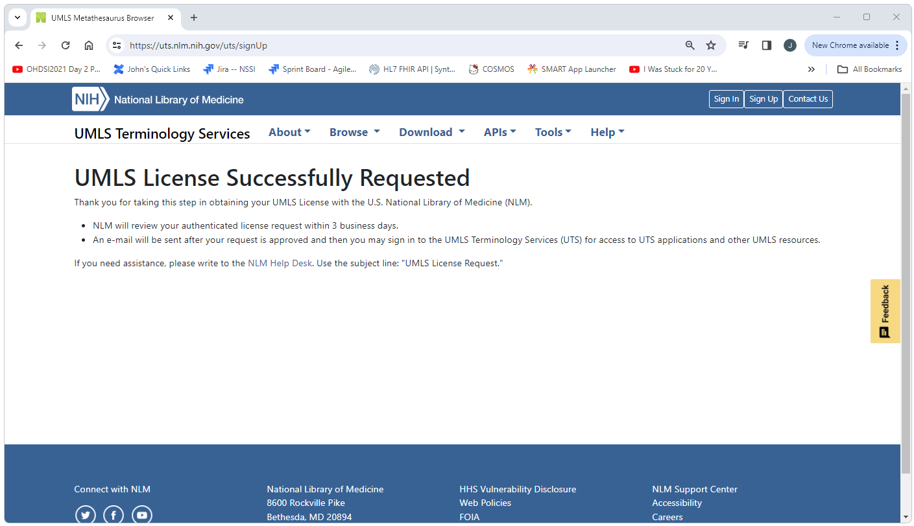

<!--
*
* javascript
*
* -->

# Getting Started with VSAC

<!-- 
*
* Introduction
* 
* -->

## Introduction

  <a href="https://vsac.nlm.nih.gov/">The Value Set Authority Center (VSAC) </a> 
  functions as a centralized repository 
  for managing and organizing value sets within the healthcare domain. 
  Value sets, akin to standardized dictionaries, 
  encode the meaning of medical terms and information, 
  facilitating interoperability and data exchange across various healthcare systems. 
  Established with the aim of promoting seamless communication and understanding of healthcare data, 
  VSAC serves as a cornerstone in ensuring consistency and standardization within the field. 
  By providing a centralized platform for the storage, management, and dissemination of value sets, 
  VSAC plays a crucial role in fostering collaboration and efficiency among healthcare providers, 
  ultimately enhancing the quality and delivery of patient care. 

  VSAC is owned and maintained by the 
  <a href="https://www.nlm.nih.gov/">National Library of Medicine (NLM) </a> 
  in collaboration with the Office of the National Coordinator for 
  <a href="https://www.healthit.gov/">Health Information Technology (ONC) </a>. 
  The NLM ensures the integrity and reliability of VSAC's content, 
  while the ONC provides strategic direction and oversight 
  to align VSAC's objectives with broader healthcare interoperability goals. 

<!-- 
*
* Get Login Credentials
* 
* -->

## Get Login Credentials

  
    Note: It will take upto 3 business days to get your license. 
    Get this process started sooner rather than later. 
  

  To fully use the VSAC resources you will need login credentials. 
  To get an account that can be used to log into VSAC go to 
  <a href="https://vsac.nlm.nih.gov/">https://vsac.nlm.nih.gov/</a>. 
  Select the Sign In link, then select the "Request One Now" link for 
  "Don't have a UMLS license/account?". 
   
  
   
   

<!--
*
* Select Identity Provider
*
-->

Select an identity provider. 
 

 
 

<!--
*
* Accept Agreement
*
-->

Scroll to the very bottom of the very long agreement page and select "Accept and Continue". 
 

 
 

<!--
*
* Fill out the form
*
-->

Provide the requested information. 
 

 
 

<!--
*
* Wait
*
-->

It will take upto 3 business days for the request to be processed. 
 

 
 

