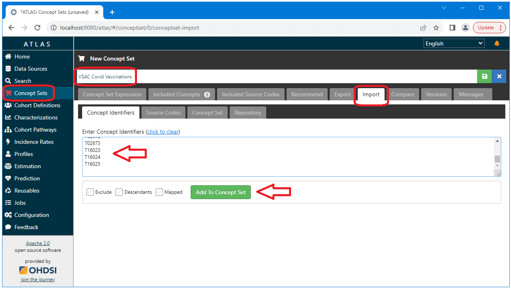
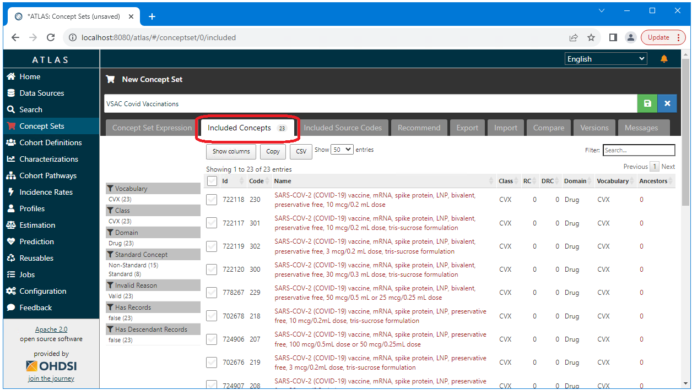

<!--
*
* javascript
*
* -->

<!-- 
*
* Quickstart
*
* -->

# Quickstart

  The vsac-to-ohdsi API and standalone application provide a simple and complete path to importing VSAC value sets into OHDSI. 
  Importing VSAC value sets into OHDSI can be done in the following few short steps 
  (detailed instructions are available on the 
  <a href="./getting-started-vsac-to-ohdsi.html">Getting Started with VSAC-TO-OHDSI</a>) page.
  
### Download the application
  The vsac-to-ohdsi standalone application can be downloaded from the releases page at 
  <a href="https://github.com/NACHC-CAD/vsac-to-ohdsi-example">
    https://github.com/NACHC-CAD/vsac-to-ohdsi-example
  </a>. 
  The download is a single zip file that includes all of the resources required to run the application. 
  The application is installed by simply unzipping this file. 
  
  
  
### Configure the application
  The application requires only four parameters to be configured:
  The auth.properties provided by default includes the following. 
  If you are using Databricks you will only need to change the url and the token values. 
<pre class="pre-scrollable">
JdbcUrl=jdbc:spark://nachc-databricks.cloud.databricks.com:443/vsac_to_omop;transportMode=http;ssl=1;httpPath=sql/protocolv1/o/3956472157536757/0123-223459-leafy532;AuthMech=3;UID=token;PWD=
Token=MY_SECRET_TOKEN_GOES_HERE
SchemaName=vsac_to_omop
DatabaseType=spark
</pre>
  
### Run the application
  The application is a standalone Java application that can be run by simply executing the following. 
<pre class="pre-scrollable">
java -jar vsac-to-ohdsi.jar "./test/zip/RetrieveMultipleValueSets_2.16.840.1.113762.1.4.1235.350.txt.zip"
</pre>
  
### Import the concepts
  The application will output a list of OHDSI concept_id values corresponding the the VSAC concepts in the value set. 
  These concept_id values can be imported into OHDSI directly using Atlas. 
   
  
  
### Success!!!
  We have now successfully imported our VSAC value set into OHDSI!
   
  

<!-- 
*
* WHAT IS VSAC
*
* -->

# What is VSAC

### Introduction to the Value Set Authority Center (VSAC)

The Value Set Authority Center (VSAC) is a central repository that provides authoritative, comprehensive, and accessible sets of codes and terms for specific clinical concepts. Operated by the National Library of Medicine (NLM), VSAC supports a variety of health care and research initiatives, including clinical quality measures, research protocols, and health information technology (IT) systems. Its primary role is to facilitate the standardization and harmonization of clinical terminology across different healthcare entities, ensuring that medical terms and codes used in electronic health records (EHRs), quality reports, and patient documents are consistent and accurately represent patient care and outcomes.

#### Advantages of Using Value Sets from VSAC

- **Standardization:** VSAC provides a standardized approach to the use of clinical terminology, which is critical for ensuring the interoperability of health information systems.
- **Quality of Care:** Access to a comprehensive repository of well-defined value sets supports clinical decision-making and quality measurement.
- **Efficiency:** Utilizing value sets from VSAC can significantly reduce the time and resources required to manage clinical terminologies.
- **Compliance:** VSAC supports compliance with regulatory requirements and standards for health information exchange.

#### Advantages of Contributing Value Sets to VSAC

- **Collaboration and Sharing:** Contributing value sets to VSAC allows organizations to share their clinical expertise and terminologies with a broader community.
- **Recognition and Influence:** Contributors to VSAC can gain recognition as leaders in their field, influencing the development of standards and best practices in clinical terminology.
- **Resource Optimization:** Organizations that contribute value sets to VSAC can reduce duplicative efforts in terminology management.
- **Enhanced Data Analytics:** Contributing to and using standardized value sets from VSAC enhances the ability of organizations to perform robust data analytics and research.

VSAC is a powerful resource for the curation and distribution of value sets, 
both with in OHDSI as well as outside of OHDSI. 
However, value sets in VSAC serve differing purposes. 
When selecting a value set from VSAC it is critical to review the value set 
and to have the value set reviewed by both informatics specialists and clinical experts. 
The use of VSAC value sets in OHDSI would be greatly enhanced 
by the creation of a mechanism to identify validated and prefered value sets 
and associate these value sets with well defined descriptions 
of how they should be used in an OHDSI context. 

In conclusion, VSAC plays a pivotal role in the standardization of clinical terminologies, supporting the interoperability of health IT systems, improving the quality of patient care, and facilitating healthcare research and analytics. Both using and contributing to VSAC's value sets offer significant advantages to healthcare providers, IT developers, researchers, and policymakers, advancing the goals of a more efficient, effective, and unified healthcare system.

<!-- 
*
* WHAT IS OHDSI
*
* -->

# What is OHDSI

The Observational Health Data Sciences and Informatics (OHDSI) is a collaborative multi-stakeholder, interdisciplinary initiative aimed at enhancing the value of observational health data through large-scale analytics. Its foundation is built on the premise of open science and shared data, utilizing the Observational Medical Outcomes Partnership (OMOP) Common Data Model (CDM) to standardize the format and content of clinical and observational research data. OHDSI's network includes a global consortium of researchers, healthcare providers, and industry partners dedicated to improving health by empowering a community to collaboratively generate the evidence that promotes better health decisions and better care. By fostering a culture of transparency, replication, and scalability, OHDSI seeks to achieve a world in which observational research produces a comprehensive understanding of health and disease.

The benefits of using OHDSI are substantial for researchers, healthcare providers, and patients alike. For one, the standardization of health data into a common model enhances interoperability between different health systems and databases, significantly expanding the potential for cross-institutional and international research collaborations. This standardization also improves the efficiency and quality of research studies by ensuring consistency in how health data is represented and analyzed, thereby accelerating the discovery and application of new insights into patient care. Moreover, OHDSI's commitment to open science principles ensures that research methodologies and results are transparent and reproducible, enhancing the credibility of observational research. Through its collaborative approach, OHDSI facilitates a more comprehensive understanding of diseases, treatment outcomes, and healthcare processes, ultimately contributing to more informed healthcare decisions and better patient outcomes.

<!-- 
*
* WHAT IS VSAC-TO-OHDSI
*
* -->

# What is vsac-to-ohdsi

The VSAC-TO-OHDSI project enables the import of any VSAC value set into OHDSI.  This includes the mapping of VSAC system identifiers and codes to OHDSI concept_id values and the creation of OHDSI concept sets that can then be used to define OHDSI phenotypes and cohorts.  

This project is public and open source under the Apache 2 license.  

A standalone application that can be run from a command line is available in Github at the location shown below 
and vsac-to-ohdsi can be integrated into other projects using the other resources shown below
<ul>
  <li>
    <b>Standalone/Example application</b> 
    The standalone application for vsac-to-ohdsi can be downloaded from Github here:  
    <a href="https://github.com/NACHC-CAD/vsac-to-ohdsi-example">
      https://github.com/NACHC-CAD/vsac-to-ohdsi-example
    </a>
     
    Detail instructions for downloading and running the standalone application are here:  
    <a href="./getting-started-vsac-to-ohdsi.html">Getting Started with vsac-to-ohdsi</a>
  </li>
  <li>
    <b>Source code for the vsac-to-ohdsi api</b>  
    The vsac-to-ohdsi API souce code is available at 
    <a href="https://github.com/NACHC-CAD/vsac-to-ohdsi">https://github.com/NACHC-CAD/vsac-to-ohdsi</a>
  </li>
  <li>
    <b>Maven repository for the vsac-to-ohdsi api</b>  
    The vsac-to-ohdsi API can be integrated into any Java project using Maven (MVN) 
    by adding something similar to the following to the projects pom.xml file. 
     
    Refer to the Standalone/Example application for a complete pom.xml file: 
    <a href="https://github.com/NACHC-CAD/vsac-to-ohdsi-example">
      https://github.com/NACHC-CAD/vsac-to-ohdsi-example
    </a>
     
    Check the Maven Central repository
    for the latest versions: 
    <a href="https://central.sonatype.com/artifact/org.nachc.cad.tools/vsactoohdsi">
      https://central.sonatype.com/artifact/org.nachc.cad.tools/vsactoohdsi
    </a> 
<pre class="pre-scrollable">
&lt;dependency&gt;
		&lt;groupId&gt;org.nachc.cad.tools&lt;/groupId&gt;
		&lt;artifactId&gt;vsactoohdsi&lt;/artifactId&gt;
		&lt;version&gt;1.1.025&lt;/version&gt;
&lt;/dependency&gt;
</pre>
</li>
  <li>
    <b>Prerequisites</b> 
    To run vsac-to-ohdsi you will need Java. 
    The vsac-to-ohdsi API has been tested using both Java 1.8 and Java 11.0. 
    The only other prerequisite is connectivity to an instance of the OHDSI CDM 
    that includes populated vocabulary tables. 
  </li>
</ul>

